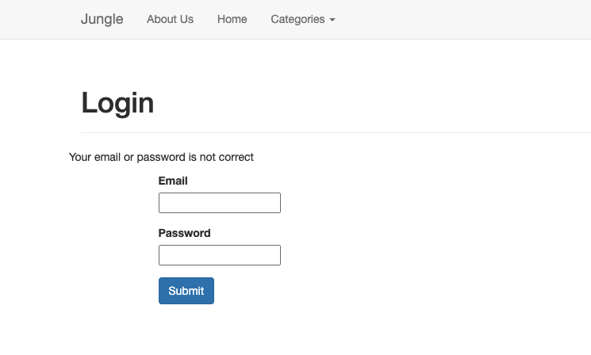

# Jungle

A mini e-commerce application built with Rails 4.2 where new features need to be implemented. 
Assignment for [Lighthouse Labs.](https://www.lighthouselabs.ca/)  

## Home page

  

## New features & Enhancements implemented / bugs fixed 
### - Feature: Sold Out Badge.
- When a product has 0 quantity, a sold out badge is displayed on the product list page.  
  

### - Feature: Admin Categories 
- Admin users can list and create new categories.
- Admins can add new products using the new category.
- Restful routes.  
  

### - Feature: User Authentication 
- As a Visitor I can go to the registration page from any page in order to create an account.
- As a Visitor I can sign up for a user account with my e-mail, password, first name and last name.
- As a Visitor I can sign in using my e-mail and password.
- As a User I can log out from any page.
- As a User I cannot sign up with an existing e-mail address (uniqueness validation).
- Passwords are not stored as plain text in the database. Instead, has_secure_password is used in the User model, leveraging the bcrypt gem.  

Sign up form shows error messages if an empty field is present, if the email has already been used, if the password is shorter than 6 characters, and if the password and password confirmation don't match  

Login form shows error message if email or password is incorrect  

### - Enhancement: Order Details Page 
- The order page contains items, their image, name, description, quantities and line item totals.
- The final amount for the order is displayed.
- The email that was used to place the order is displayed.  
  

### - Bug: Missing Admin Security 
- User must enter HTTP auth login/password to access admin functionality

### - Bug: Checking Out with Empty Cart 
- When the cart is empty and the user goes to the carts#show page, instead of displaying the contents and a stripe checkout button, display a friendly message about how it is empty and link to the home page.  
  

### -Create Automated Tests with RSpec & Capybara  

## Setup

1. Fork and clone this repository.
2. Run `bundle install` to install dependencies
3. Create `config/database.yml` by copying `config/database.example.yml`
4. Create `config/secrets.yml` by copying `config/secrets.example.yml`
5. Run `bin/rake db:reset` to create, load and seed db
6. Create .env file based on .env.example
7. Sign up for a Stripe account
8. Put Stripe (test) keys into appropriate .env vars
9. Run `bin/rails s -b 0.0.0.0` to start the server

## Stripe Testing

Use Credit Card # 4111 1111 1111 1111 for testing success scenarios.

More information in their docs: <https://stripe.com/docs/testing#cards>

## Dependencies

* Rails 4.2 [Rails Guide](http://guides.rubyonrails.org/v4.2/)
* PostgreSQL 9.x
* Stripe
